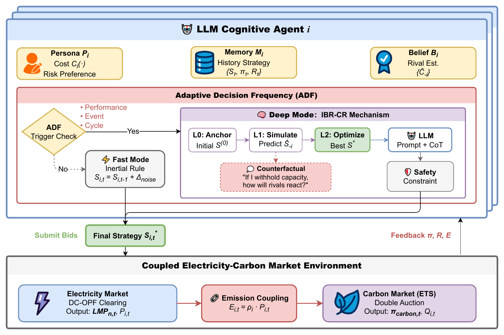
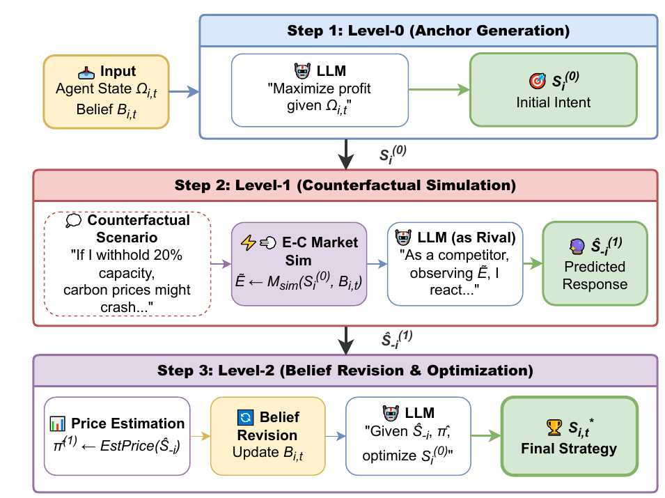

# LLM-CECM: A Simulation Framework for Strategic Generation Behavior in Coupled Electricity-Carbon Markets


[](https://www.sciencedirect.com/science/article/pii/S0960148126009651)

Welcome to the LLM-CECM project main page!
This repository is the official code companion of the paper
*"LLM-CECM: A simulation framework for strategic generation behavior in coupled electricity-carbon markets"*
(Renewable Energy, Vol. 273, 2026). This page explains how to run the framework, how to reproduce the
experiments of the paper, and how the code is organised.

<p align="center">
  
</p>

---

## Build and Run

```bash
# Create a virtual environment and install the dependencies
make install
# (equivalent to: python3 -m venv .venv && .venv/bin/pip install -r requirements.txt)

# Configure the LLM API key used by the cognitive agents
cp .env.example .env          # then fill in GOOGLE_API_KEY

# Run the framework (Experiment 1 with the IBR-ADF agent)
make run
```

All simulations are launched from the `src/` directory through a single entry point:

```bash
cd src
python run_experiments.py --help
python run_experiments.py --experiment exp1 --variant IBR-ADF
python run_experiments.py --experiment exp1 --variant IBR-ADF --quick-test   # 3-round smoke run
```

Simulation outputs (per-round CSV records, behaviour logs in JSON and figures) are written to
`src/results/<experiment>/<variant>/`.

### Reproduce the Paper Experiments

| Paper section | What is compared | Agents / horizon | Command |
|---|---|---|---|
| IV-B, Table III, Figs. 3-6 | RB-Agent vs. RL-Agent vs. IBR-ADF-Agent | 50 agents, 10 rounds | `make exp1` |
| IV-C, Tables IV-V, Fig. 7 | IBR-Agent (no ADF) vs. IBR-ADF-Agent | 50 agents, 20 rounds | `make exp2` |
| IV-E, Table VI | ADF threshold δ<sub>perf</sub> ∈ {0.05, 0.15, 0.25} | 50 agents, 20 rounds | `make sensitivity` |
| IV-D | ADF-Agent (Level-0 only) vs. IBR-ADF-Agent | 50 agents, 30 rounds | `make exp3` |
| all of the above | – | – | `make all` |

Every experiment simulates the full population of 50 generator agents defined in
`src/true_digital_twin_agents.json`. The simulation horizon (`num_rounds`) and the scenario data of each experiment are
set in `src/experiments/experiment_configs.py` and can be changed there.

Each target maps onto `run_experiments.py`, e.g.
`python run_experiments.py --experiment exp2 --variant with_adf --delta-perf 0.05`.
The reported numbers of the paper are collected in [`results/`](results/README.md).

### Check Style

```bash
# Syntax errors and undefined names (flake8)
make check-style
```

### Run Tests

```bash
# Offline tests: a deterministic mock replaces the LLM, no API key needed
make test
```

The test suite checks the experiment switches (ADF / IBR-CR / δ<sub>perf</sub>), the cognitive modules and their
fall-backs, and runs short end-to-end coupled simulations with 50 agents.

### Clean the Project

```bash
# Remove caches and locally generated simulation outputs
make clean
```

---

## User page

LLM-CECM was developed by Yuheng Cheng, Yike Chen, Xuning Tan and Junhua Zhao (The Chinese University of Hong Kong,
Shenzhen), Xiyuan Zhou and Wenxuan Liu (Nanyang Technological University) and Huan Zhao (The Hong Kong Polytechnic
University). Corresponding authors: Wenxuan Liu and Junhua Zhao.

The framework consists of a **coupled electricity-carbon market environment** and a population of
**LLM-driven generator agents**, together with rule-based and reinforcement-learning baselines. It is designed to
study how generation companies behave strategically when electricity prices, carbon prices and policy
announcements interact.

### LLM-CECM Abstract

The deep integration of electricity and carbon markets (CECM) introduces complex strategic interactions that
challenge existing simulation methods: equilibrium and reinforcement-learning models either lack behavioural realism
or scale poorly. LLM-CECM uses Large Language Models as the cognitive core of market agents and contributes

1. **LLM-driven cognitive agents** with persona, beliefs and dual-layer memory, which read unstructured policy text
   and produce structured, interpretable bids;
2. an **Adaptive Decision Frequency (ADF)** architecture that reduces LLM calls by more than 80 % through
   "rational inattention";
3. an **Iterated Belief Revision with Counterfactual Reasoning (IBR-CR)** mechanism that accelerates strategy
   convergence.

Experiments on the IEEE 118-bus system with 50 generator agents calibrated on the Australian National Electricity
Market (NEM) show that the framework reproduces strategic withholding and cost pass-through under policy shocks and
outperforms reinforcement-learning baselines in zero-shot adaptability.

### Market Environment Abstract

* **Electricity market** – day-ahead OPF clearing on the IEEE 118-bus network (54 generator buses, 186 lines),
  producing locational marginal prices and dispatch; a merit-order clearing is used as a fall-back.
* **Carbon market (ETS)** – order-book continuous double auction with price-then-time priority, quota accounting
  `E = ρ · P` and a market maker for liquidity.
* **Coupling** – carbon cost pass-through into electricity bids and emission feedback from dispatch to the quota
  balance, settled every round.
* **Scenario engine** – real AEMO NSW1 spot prices (15 July 2024), gas-price shocks, coal outages, renewable
  capacity factors and policy announcements that are published before they take effect.

### Cognitive Agent Abstract

Each agent is the tuple ⟨Persona, Memory, Beliefs, LLM⟩:

* **Persona** – technology, cost function, emission factor and bidding personality of a real NEM unit;
* **Memory** – short-term working memory of the last *K* rounds (strategy, clearing prices, profit) and
  long-term semantic memory summarised by the LLM;
* **Beliefs** – estimates of rival costs and market trends, updated every round and revised semantically by the
  LLM (Eq. 7) whenever the agent deliberates;
* **Structured prompts** – role, observation, chain-of-thought instructions and a JSON output schema;
* **Safety layer** – projects raw LLM bids onto the feasible capacity / ramping domain.

### ADF Abstract

Deliberation is triggered only when it is worth its cost. An agent enters **Deep Mode** when its recent profit
falls below its target (performance-driven, δ<sub>perf</sub>), when prices move sharply or a policy is announced
(event-driven), or at a fixed review cycle (cycle-driven); otherwise it stays in the inexpensive **Fast Mode**
and adjusts its last strategy inertially.

### IBR-CR Abstract

<p align="center">
  
</p>

Inspired by level-k reasoning, a Deep-Mode decision is rehearsed internally: **Level-0** anchors an initial
strategy, **Level-1** lets the LLM role-play a rival reacting to that strategy, and **Level-2** revises beliefs
and optimises the final bid against the predicted reaction.

### Results at a Glance

| Experiment | Key result |
|---|---|
| Behaviour validation | Electricity MAPE 9.16 % (RB 18.80 %, RL 14.20 %); carbon MAPE 0.87 % |
| ADF efficiency | LLM calls 10,805 → 2,105 (−80.5 %), runtime 32.95 h → 6.08 h, price deviation < 0.4 % |
| IBR-CR convergence | Price convergence at round 31 (baseline not converged in 72 rounds); price SD 5.49 → 2.69 CNY/MWh (−51 %); +12.3 % profit |

<p align="center">
  
</p>

Full tables and figures: [`results/README.md`](results/README.md).

---

## Developer page

### Architecture

The code follows the structure of the paper. The environment (market clearing, events) is separated from the
agents, and every agent type implements the same `BaseAgent` interface (`decide_coupled_bid`, `update_state`),
so LLM, rule-based and RL agents can be mixed in one simulation.

| Paper | Module |
|---|---|
| II-A Electricity market (OPF, LMP) | `src/market/clearing_mechanism.py`, `src/market/market_environment.py` |
| II-B Carbon market (double auction) | `src/market/carbon_market.py` |
| II-C Coupling (pass-through, emission feedback) | `src/market/coupled_market.py` |
| III-A Rolling-horizon simulation loop | `src/simulation/simulator.py` (`run_coupled`), `src/simulation/event_manager.py` |
| III-B Cognitive agent | `src/agents/llm_agent.py` |
| III-B Memory / Beliefs | `src/agents/memory_module.py`, `src/agents/belief_module.py` |
| III-B Prompt templates | `src/llm_interface/prompt_manager.py`, `src/llm_interface/llm_client.py` |
| III-C ADF | `src/agents/adf_module.py` |
| III-D IBR-CR | `LLMAgent._decide_with_ibr_cr` in `src/agents/llm_agent.py` |
| IV Baselines | `src/agents/zi_agent.py` (RB), `src/agents/rl_agent_enhanced.py` + `src/experiments/training/` (RL, PPO) |
| IV Experiments | `src/experiments/experiment_configs.py`, `src/experiments/experiment_runner.py`, `src/run_experiments.py` |
| IV Metrics and figures | `src/utils/visualization.py`, `src/simulation/behavior_analyzer.py` |

### Simulation Loop

`MarketSimulator.run_coupled()` executes the five phases of Section III-A in every round:

1. **Information disclosure** – demand, renewable output, fuel prices and announcements
   (`EventManager.get_market_information_for_agents`);
2. **Cognitive processing** – `AdaptiveDecisionFrequency.should_trigger_llm_decision` selects Fast or Deep Mode;
3. **Strategy formulation** – inertial rule (Fast) or belief revision + IBR-CR (Deep) in `LLMAgent.decide_coupled_bid`;
4. **Market clearing** – carbon double auction, then OPF electricity clearing (`CoupledMarket.run_coupled_clearing`);
5. **Learning and memory update** – profits, beliefs and memory are updated through `LLMAgent.update_state`.

Agent decisions within a round are executed in parallel (`_execute_agents_parallel`).

### Project Structure

```
LLM-CECM/
├── README.md
├── Makefile                     # install / run / exp1-3 / check-style / test / clean
├── requirements.txt
├── .env.example                 # GOOGLE_API_KEY template
├── src/                         # simulation framework
│   ├── run_experiments.py       # entry point for all paper experiments
│   ├── agents/                  # LLM agent, ADF, belief, memory, RL and rule-based agents
│   ├── market/                  # OPF clearing, carbon double auction, market coupling
│   ├── simulation/              # simulator, base configuration, event engine, behaviour analysis
│   ├── llm_interface/           # LLM client and prompt templates
│   ├── experiments/             # experiment configurations, runner, RL training scripts
│   ├── utils/                   # logging, bid validation, visualisation
│   ├── true_digital_twin_agents.json   # 50 NEM-calibrated generator agents
│   ├── generate_true_digital_twin_agents.py
│   ├── data_integration/        # AEMO price data (NEMOSIS) and ground-truth configuration
│   ├── tools/                   # fuel-mix calibration ratios
│   └── models/multi_agent_high_price/  # pre-trained PPO policies of the RL baseline
├── results/                     # results reported in the paper (tables and figures)
├── docs/figures/                # framework and IBR-CR diagrams
└── tests/                       # offline test suite with a mock LLM
```

### Configuration

Experiment-level settings live in `src/experiments/experiment_configs.py`; defaults for the market, carbon market
and LLM client are in `src/simulation/config.py`. The most relevant switches are:

| Key | Location | Meaning |
|---|---|---|
| `enable_adf` | `llm_config` | Adaptive Decision Frequency on/off |
| `enable_ibr_cr` | `llm_config` | IBR-CR (Level-0/1/2) on/off; off = Level-0 only |
| `enable_llm_belief` | `llm_config` | LLM semantic belief revision before Deep-Mode decisions |
| `enable_llm_memory_summary`, `memory_summary_interval` | `llm_config` | LLM long-term memory and its update interval |
| `working_memory_k`, `inject_cognitive_state` | `llm_config` | Short-term memory length and prompt injection |
| `profit_threshold` (= 1 − δ<sub>perf</sub>) | `adf_config` | Performance-driven trigger |
| `price_volatility_threshold` | `adf_config` | Event-driven trigger |
| `strategic_review_cycle` | `adf_config` | Cycle-driven trigger (rounds) |
| `model` | `llm_config` | LLM backbone, default `gemma-3-27b-it` |

`build_adf_config(delta_perf=...)` converts the paper's δ<sub>perf</sub> into the ADF parameters.

### Data

* **Generator agents** – `true_digital_twin_agents.json` holds the 50 agents (Table II of the paper). It is produced by
  `generate_true_digital_twin_agents.py` from the AEMO *NEM Generation Information* workbook and a NEMWEB
  `DISPATCH_UNIT_SCADA` file placed under `src/downloads/`.
* **Market prices** – `data_integration/real_aemo_data_config.json` contains the NSW1 spot prices used as ground truth;
  `data_integration/nemosis_fetcher.py` re-downloads them with [NEMOSIS](https://github.com/UNSW-CEEM/NEMOSIS)
  (`pip install nemosis`).
* **RL baseline** – the PPO policies in `models/multi_agent_high_price/` were trained offline with
  `experiments/training/train_multi_agent_rl.py` (Stable-Baselines3).

### Extending the Framework

* **New agent type** – subclass `agents.base_agent.BaseAgent`, implement `decide_coupled_bid` and `update_state`,
  and register it in `ExperimentRunner.prepare_agents`.
* **Different LLM** – `LLMClient.chat` wraps the Google Generative Language REST API; replace this method to use another
  provider. Prompt templates are centralised in `PromptManager`.
* **New scenario** – add entries to `market_events` (announcement time, effect time, affected fuel, multiplier) in an
  experiment configuration.

### Testing

`tests/` contains an offline test suite (`pytest`). A deterministic mock LLM recognises every prompt type (bidding,
rival simulation, belief revision, memory summary), so the complete pipeline – ADF switching, IBR-CR, belief and
memory updates, market clearing and result logging – can be exercised without network access.

---

## Citation

If you use this code, please cite:

```bibtex
@article{cheng2026llmcecm,
  title   = {LLM-CECM: A simulation framework for strategic generation behavior in coupled electricity-carbon markets},
  author  = {Cheng, Yuheng and Chen, Yike and Zhou, Xiyuan and Tan, Xuning and Zhao, Huan and Liu, Wenxuan and Zhao, Junhua},
  journal = {Renewable Energy},
  volume  = {273},
  year    = {2026},
  url     = {https://www.sciencedirect.com/science/article/pii/S0960148126009651}
}
```

## Acknowledgements

Market data are provided by the Australian Energy Market Operator (AEMO) through NEMWEB. The electricity clearing uses
[PYPOWER](https://github.com/rwl/PYPOWER), the RL baseline uses
[Stable-Baselines3](https://github.com/DLR-RM/stable-baselines3), and the cognitive agents run on Google's Gemma models.
