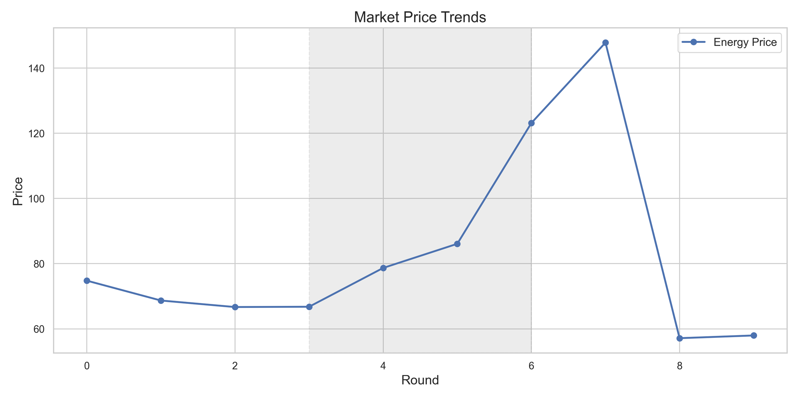
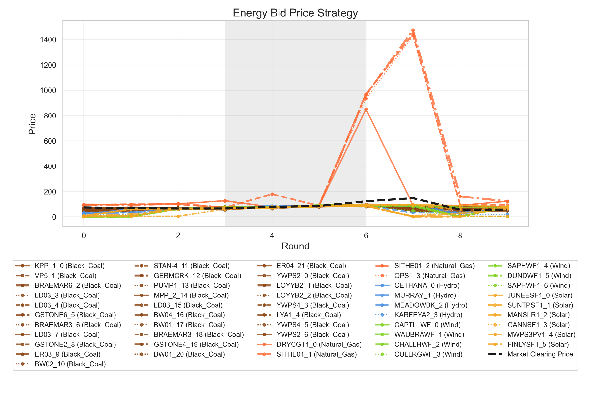
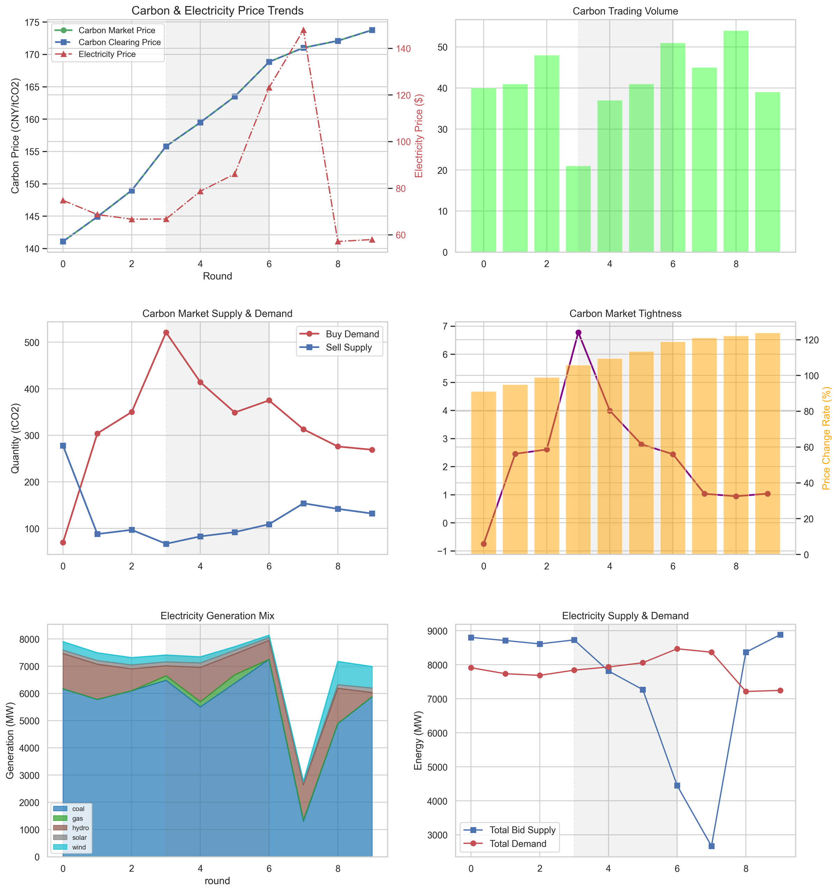
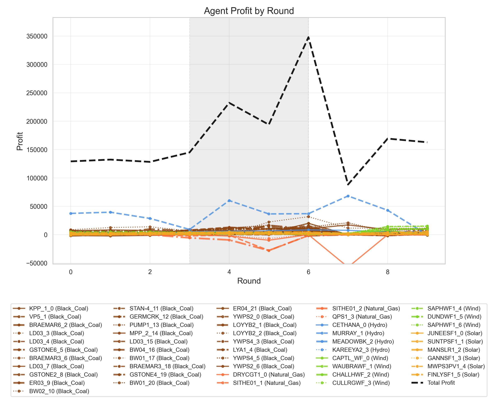
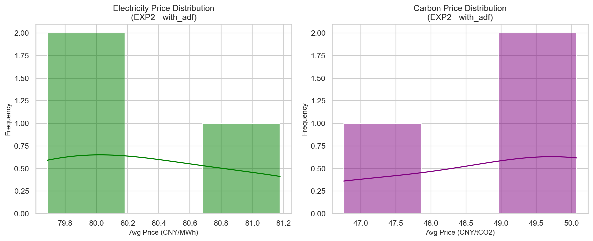

# Experimental Results

This folder collects the results reported in the paper. Tables are provided as CSV files and figures as PNG images.
Running the experiments with `run_experiments.py` writes fresh outputs to `src/results/` instead, so these reference
results are never overwritten.

All LLM agents use Gemma-3-27B. Reported values are averages over independent Monte Carlo runs.

```
results/
├── exp0_setup/                     # Table II   – agent population
├── exp1_behavior_validation/       # Table III, Figs. 3-6
├── exp2_adf_efficiency/            # Tables IV-VI, Fig. 7
└── exp3_ibr_cr_effectiveness/      # Section IV-D convergence results
```

## Simulation Setup (Table II)

IEEE 118-bus network (54 generator buses, 186 lines) with 50 generator agents calibrated on AEMO registered NEM units,
total installed capacity ≈ 15,067 MW. Marginal costs range from 0 to 149.65 CNY/MWh. Electricity ground truth: AEMO
NEMWEB 30-minute spot prices, NSW1 region, 15 July 2024.

| Fuel type | Count | Capacity (MW) | Share | Emission factor (tCO₂/MWh) |
|---|---:|---:|---:|---:|
| Black Coal | 22 | 8,863 | 58.8 % | 0.80 |
| Brown Coal | 7 | 3,286 | 21.8 % | 0.80 |
| Hydro | 4 | 1,295 | 8.6 % | 0.00 |
| Wind | 7 | 900 | 6.0 % | 0.00 |
| Solar | 6 | 410 | 2.7 % | 0.00 |
| Natural Gas | 4 | 313 | 2.1 % | 0.40 |

File: [`exp0_setup/table2_agent_fuel_types.csv`](exp0_setup/table2_agent_fuel_types.csv)

## Experiment 1 – Agent Behavioural Patterns and Authenticity

A "future carbon-quota tightening" policy is announced before it takes effect, together with a coal outage and a
renewable surge. The IBR-ADF-Agent is compared with a rule-based agent (marginal cost × (1 + markup), markup ∈
[0.05, 0.15]) and a PPO agent trained offline for 100,000 episodes.

**Table III – prediction errors against real AEMO prices**

| Model | Elec. MAPE (%) | Carb. MAPE (%) | MASE |
|---|---:|---:|---:|
| RB-Agent | 18.80 | 2.71 | 0.375 |
| RL-Agent | 14.20 | 3.80 | 0.335 |
| **IBR-ADF-Agent** | **9.16** | **0.87** | **0.289** |

File: [`exp1_behavior_validation/table3_prediction_errors.csv`](exp1_behavior_validation/table3_prediction_errors.csv)

| Fig. 3 – Simulated electricity price (shaded: announcement window) | Fig. 4 – Energy bid strategies |
|---|---|
|  |  |

**Fig. 5 – Carbon market dynamics and coupled electricity-market interactions**



**Fig. 6 – Agent profit by round**



Observed behaviours: pre-emptive price increases by gas units after the announcement and before the policy takes
effect (strategic withholding), carbon cost pass-through into electricity prices, and cross-market arbitrage by
low-carbon units (e.g. the hydro unit `MURRAY_1` bidding aggressively before a forecast wind surge while selling
surplus carbon quotas).

## Experiment 2 – Efficiency and Accuracy of the ADF Architecture

**Table IV – IBR-Agent (Deep Mode every round) vs. IBR-ADF-Agent**

| Metric | IBR-Agent | IBR-ADF-Agent | Change |
|---|---:|---:|---:|
| Total LLM calls | 10,805 | **2,105** | ↓ 80.5 % |
| Total runtime (h) | 32.95 | **6.08** | ↓ 81.5 % |
| Avg. electricity price (CNY/MWh) | 45.46 | 45.63 | dev. < 0.4 % |
| Total profit (CNY) | 141,654 | 137,709 | dev. < 2.8 % |

**Table V – IBR-ADF-Agent over repeated runs (N = 10)**

| Metric | Mean | SD | Min | Max | CV |
|---|---:|---:|---:|---:|---:|
| Total profit (CNY) | 398,607 | 32,585 | 378,262 | 436,190 | 8.2 % |
| Avg. price (CNY/MWh) | 80.33 | 0.77 | 79.68 | 81.18 | 0.96 % |
| Price SD | 2.41 | 0.32 | 2.08 | 2.72 | – |
| Price MAPE (%) | 14.65 | 0.70 | 14.10 | 15.44 | 4.8 % |
| Runtime (min) | 7.34 | 0.18 | 7.19 | 7.54 | 2.5 % |

**Table VI – sensitivity of the ADF threshold δ<sub>perf</sub>**

| δ<sub>perf</sub> | LLM calls | Elec. MAPE | Volatility (SD) |
|---|---:|---:|---:|
| 0.05 (Conservative) | 8,450 | 8.41 % | 2.35 |
| **0.15 (Base)** | **2,105** | **8.76 %** | **2.41** |
| 0.25 (Aggressive) | 840 | 12.33 % | 4.12 |

With δ<sub>perf</sub> = 0.15 a complete 24-hour simulation costs about USD 12.5 in tokens, compared with USD 65.0
without ADF.

**Fig. 7 – Distribution of simulated electricity and carbon prices across repeated runs (with ADF)**



Files: [`table4_adf_efficiency.csv`](exp2_adf_efficiency/table4_adf_efficiency.csv),
[`table5_ibr_adf_monte_carlo.csv`](exp2_adf_efficiency/table5_ibr_adf_monte_carlo.csv),
[`table6_delta_perf_sensitivity.csv`](exp2_adf_efficiency/table6_delta_perf_sensitivity.csv)

## Experiment 3 – Strategy Convergence under IBR-CR

The full 50-agent system is simulated; convergence is assessed in a congested sub-region of the IEEE 118-bus network,
where five coal generators compete for limited transmission capacity and strategy oscillation is most likely. The
IBR-ADF-Agent (full counterfactual reasoning) is compared with a baseline that uses Level-0 myopic best response only.
Convergence is defined as a rolling price standard deviation below 3 CNY/MWh for 10 consecutive rounds, tracked over a
72-round horizon.

| Metric | Level-0 baseline | IBR-ADF-Agent |
|---|---:|---:|
| Convergence round | not converged within 72 rounds | **31** |
| Avg. price SD (CNY/MWh) | 5.49 | **2.69** (↓ 51 %) |
| Avg. agent profit | reference | **+12.3 %** |

File: [`exp3_ibr_cr_effectiveness/convergence_summary.csv`](exp3_ibr_cr_effectiveness/convergence_summary.csv)
